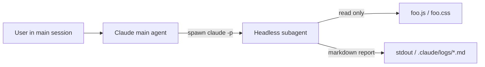
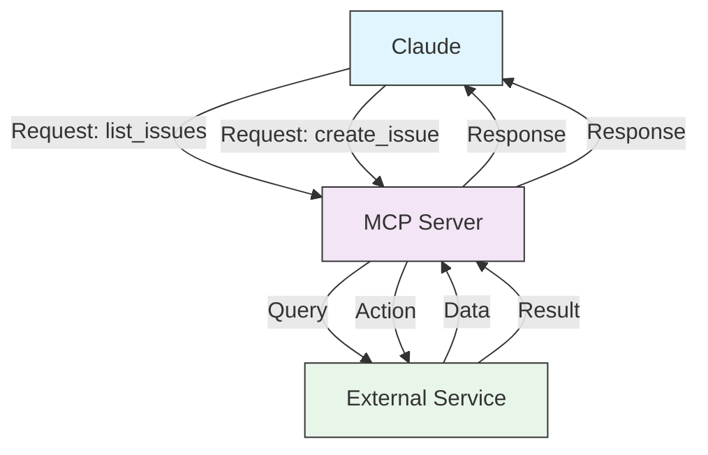

# Claude Code 分享与实际应用
!!! danger 
注意：本次分享使用的 **claude code** 版本为 **V2.1.94** 
!!!
## 一、Claude Code 的来源与发展历史

### 1.1 Anthropic 公司背景

Anthropic 由 **Dario Amodei**、**Daniela Amodei** 等前 OpenAI 核心研究人员于 2021 年创立，公司核心理念是：

- 构建强大且可被人类理解和控制的 AI 系统
- 以"宪法 AI"（Constitutional AI）方法论驯化大模型行为
- 长期专注于 AI 安全研究，而非单纯追求能力竞赛

### 1.2 发展时间线

<style>
  .timeline-wrap {
    border-left: 3px solid #F57C00;
    padding-left: 24px;
    margin: 24px 0;
  }
  .timeline-wrap p {
    position: relative;
    padding: 10px 14px;
    margin-bottom: 12px;
    background: #FAFAFA;
    border-radius: 6px;
    font-size: 18px;
    line-height: 1.7;
    color: #333;
  }
  .timeline-wrap p::before {
    content: '';
    position: absolute;
    left: -30px;
    top: 50%;
    transform: translateY(-50%);
    width: 10px;
    height: 10px;
    border-radius: 50%;
    background: #fff;
    border: 2.5px solid #F57C00;
  }
  .timeline-wrap p.competitor {
    background: #F5F5F5;
    color: #888;
  }
  .timeline-wrap p.competitor::before {
    border-color: #BDBDBD;
  }
  .timeline-wrap p strong {
    color: #F57C00;
    margin-right: 6px;
    white-space: nowrap;
  }
  .timeline-wrap p.competitor strong {
    color: #BDBDBD;
  }
</style>
<div class="timeline-wrap">
  <p><strong>2021 年</strong> — Anthropic 由前 OpenAI 核心成员创立，专注安全可靠的 AI 研究</p>
  <p><strong>2023 年 3 月</strong> — Claude 1 发布，以宪法 AI（Constitutional AI）为核心设计理念</p>
  <p><strong>2023 年 7 月</strong> — Claude 2 上线，上下文窗口突破 100K tokens，代码能力大幅提升</p>
  <p><strong>2024 年 3 月</strong> — Claude 3 系列（Haiku / Sonnet / Opus）发布，编程基准测试超越 GPT-4</p>
  <p><strong>2024 年 9 月</strong> — Boris Cherny（TypeScript 书籍作者）加入 Anthropic，开始原型化开发者工具</p>
  <p><strong>2024 年 10 月</strong> — Claude Code 内测，专为软件开发场景打造的 Agentic AI 工具链</p>
  <p><strong>2024 年 11 月</strong> — MCP（Model Context Protocol）开放标准发布，为工具扩展能力奠定基础</p>
  <p><strong>2025 年 2 月</strong> — Claude Code 研究预览版正式上线，随 Claude 3.7 Sonnet 同步发布，支持终端调用、MCP 协议、复杂多步任务</p>
  <p class="competitor"><strong>2025 年 4 月</strong> — OpenAI 发布 Codex CLI，行业跟进终端 Agent 架构</p>
  <p><strong>2025 年 5 月</strong> — Claude 4（Sonnet 4 / Opus 4）发布，Claude Code 正式 GA，新增代码执行、Files API，成为业界标杆</p>
  <p class="competitor"><strong>2025 年 6 月</strong> — Google 发布 Gemini CLI，终端 AI 编程工具成为行业主流范式</p>
  <p><strong>2025 年 11 月</strong> — Claude Opus 4.5 发布，价格下降 67%，重夺编程基准测试榜首</p>
<p><strong>2026 年 1 月</strong> — Claude Code 企业版正式落地，支持私有 Git 仓库对接、本地部署与团队权限管理</p>
<p><strong>2026 年 2 月</strong> — NASA 公开 Claude Code 成功用于火星探测器路线规划（任务执行于2025年12月，官方公布于2026年2月）</p>
<p><strong>2026 年 2 月</strong> — Claude Opus 4.6 / Sonnet 4.6 发布，Claude Code 同步上线 Agent Teams、Rewind、自动记忆等核心能力</p>
<p><strong>2026 年 3 月</strong> — Claude Code 密集迭代，上线语音模式、Computer Use、远程控制、1M token 上下文、Auto 模式，全面进入 Agent 时代</p>
<p><strong>2026 年 3 月</strong> — Claude 最新模型正式接入 Microsoft 365 Copilot，面向企业级市场全面开放</p>
<p><strong>未来？</strong> — 新模型Capybara, Opus 4.7, and Sonnet 4.8</p>
</div>

>  从「实验性副项目」到「行业标杆」，Claude Code 只用了不到一年时间。
### 1.3 Claude Code 诞生的背景

传统 AI 编程助手（如 GitHub Copilot）的核心模式是"补全"——你写代码，AI 给建议。

Claude Code 从根本上改变了这一范式：

- **从"代码补全"进化到"任务执行"**：你描述需求，AI 完整实现
- **具备真正的 Agentic 能力**：可以读文件、搜索代码库、执行命令、自我纠错
- **深度理解大型工程代码库上下文**：不是单文件补全，而是全局架构感知
- **支持 MCP（Model Context Protocol）协议**：可扩展对接任意外部工具

---

## 二、Claude Code 快速上手

### 2.1 安装与启动

安装非常简单，通过 npm 全局安装即可：


```shell [id:windows]
# npm
$ npm install -g @anthropic-ai/claude-code
$ cd your-project && claude
```

```shell [id:macOS]
#Homebrew 
brew install --cask claude-code
#curl
curl -fsSL https://claude.ai/install.sh | bash
```

```shell [id:Linux]
curl -fsSL https://claude.ai/install.sh | bash
```

### 2.2 登录方式

claude code 一共有三种登录方式：
```
    # 通过浏览器登录 Claude.ai 账号
    1. Claude account with subscription · Pro, Max, Team, or Enterprise

    # 通过 API Key 方式登录
    2. Anthropic Console account · API usage billing

    # 第三方云平台
    3. 3rd-party platform · Amazon Bedrock, Microsoft Foundry, or Vertex AI
```

| 对比维度 | Claude 订阅账号<br/>（Pro/Max/Team/Enterprise） | Anthropic Console<br/>（API 计费） | 第三方平台<br/>（Bedrock/Vertex/Azure） |
|----------|------------------------------------------|-----------------------------|------------------------------------|
| **本质定位** | 给「人」用的订阅产品 | 给「程序」用的 API 后台 | 通过云厂商中转调用 Claude |
| **计费方式** | 固定月费 | 按 token 用量计费 | 按云厂商定价计费 |
| **适合规模** | 个人 / 小团队 | 中小团队 / 开发者 | 中大型企业 |
| **技术门槛** | 低，开箱即用 | 中，需要集成 API | 高，需要配置云平台权限 |
 
--- 
 
**选型建议**
```
个人学习 / 日常使用
└─ Pro 订阅
 
个人高频开发
└─ Max 订阅
 
5~20 人前端团队协作
└─ Team 订阅
 
开发 AI 产品 / 需要 API 集成
└─ Anthropic Console
```
 
### 2.3 权限模式

Claude Code 通过 **权限模式（permission mode）** 控制：在编辑文件、执行 Shell、发起网络请求等可能改变环境的行为之前，是否暂停并请你确认。模式只通过 **CLI 状态栏 / VS Code 底部指示器 / 设置项** 切换，**不能**靠对话里「说一句切换模式」生效。


#### 2.3.1 默认模式（`default`）

- **行为**：基线偏「每一步都可见」。**只读**类操作（读文件、浏览代码库）通常可连续进行；一旦涉及**写入/执行**（改文件、跑命令、网络请求等），会停下来请求批准。
- **适合**：初次使用、敏感代码或密钥附近、希望**全程人工把关**的场景。
- **说明**：无论哪种模式，对 [受保护路径](https://code.claude.com/docs/en/permission-modes#protected-paths)（如 `.git`、部分全局与 Claude 配置等）的写入都**不会**被自动批准，避免误伤仓库与配置。

#### 2.3.2 自动接受编辑（`acceptEdits`）— 与「三档循环」中间档

在终端里按 **`Shift+Tab`** 时，默认循环顺序为：**`default` → `acceptEdits` → `plan`**。截图或教程里常说的三种模式，中间这一档通常指 **`acceptEdits`**（VS Code 扩展中对应 **Edit automatically / 自动编辑**），**不是**下面单独开启的 **Auto 模式（`auto`）**。

- **行为**：可在**工作目录**内**自动创建/编辑文件**，并自动批准一批常见文件系统命令（如 `mkdir`、`touch`、`mv`、`cp`、`rm` 等，以当前版本文档为准）。工作区外路径、其它 Bash、网络请求等仍会提示。
- **适合**：你愿意在 **IDE / `git diff`** 里**事后审查**，而不是在对话里逐条点「允许编辑」。
- **启动示例**：`claude --permission-mode acceptEdits`

#### 2.3.3 计划模式（`plan`）

- **行为**：**先调研、先出方案，不修改你的业务源代码**。可以读文件、用命令探索、写出实施计划；**不会对源码做实际编辑**（规划与执行分离）。需要确认时的提示规则与默认模式一致，核心是**约束为「只规划、不改代码」**。
- **进入方式**：`Shift+Tab` 切到 plan；单条消息前缀 **`/plan`**；或 `claude --permission-mode plan`。
- **计划就绪后**：可选择批准后进入 `auto`、进入 `acceptEdits`、仍逐项审核、继续迭代计划等（以当前版本交互为准）。

#### 2.3.4 进阶：Auto 模式（`auto`，需单独开启）

这是与 **`acceptEdits`** 不同的模式：在**满足账号、模型、提供方等条件**时，通过 **`--enable-auto-mode`** 等启用，尽量**减少权限弹窗**，并由**单独的分类器**在执行前评估风险；高风险操作仍可能被拦截。适用于长任务、希望减少「确认疲劳」但仍有一层自动把关时。**不适合**替代对敏感操作的 Code Review。细则与限制见官方文档 [Choose a permission mode](https://code.claude.com/docs/en/permission-modes)。

#### 2.3.5 切换与默认模式

| 方式 | 说明 |
|------|------|
| CLI | 会话中 **`Shift+Tab`** 在 `default` / `acceptEdits` / `plan` 间循环；启用可选模式后，循环中还会插入其它模式（顺序以文档为准） |
| 启动参数 | 如 `claude --permission-mode plan` |
| 配置文件 | 在 `settings` 中设置 `permissions.defaultMode`（如 `"acceptEdits"`）作为默认 |

## 三、Claude Code 核心能力 - Skills

### 3.1 什么是 Skills？
**Skills** 是将你的专业知识打包成可组合资源的模块，能把通用 AI 助手转变为针对特定领域的专家。本质上就是一个包含 SKILL.md 文件的文件夹，里面放着 Claude 执行特定任务所需的指令、脚本和资源。
Skills 就像「可执行的专业知识」——它们是结构化的、可强制执行的工作流，能引导 Claude 以严谨的方式完成复杂任务，避免 AI 急于写代码而跳过必要的检查步骤。

### 3.2 Skill 核心优势

Skills 极大地减少了 token 消耗。每个 skill 在扫描时只占用约 100 个 token（仅读取 name + description），只有在真正触发时才加载完整内容（约 5000 token）。这意味着你可以同时挂载多个 skill，而不会撑爆上下文窗口。

### 3.3 Skill 文件结构
每个 skill 的基本结构如下：

```
my-skill/
    ├── SKILL.md        # 主文件，包含 frontmatter 配置和指令
    ├── scripts/        # 可选：可执行脚本
    │   └── helper.py
    └── resources/      # 可选：模板、配置等支撑文件
        └── template.json
```
SKILL.md 示例：
``` 
---
name: explain-code
description: 解释代码结构，使用类比和图示。当用户问"这段代码怎么工作的"时自动触发。
---

解释代码时，请按以下步骤进行：
1. 先用生活中的类比描述
2. 画 ASCII 图展示结构和流程
3. 逐步讲解代码执行过程
4. 指出一个常见误区
```

### 3.4 Skill 安装
```bash
    # 从官方市场安装
    /plugin marketplace add anthropics/skills

    # 或安装本地目录
    /plugin add /path/to/skill-directory

    # 放到全局目录（所有项目可用）
    ~/.claude/skills/your-skill/SKILL.md

    # 放到项目目录（仅当前项目可用）
    .claude/skills/your-skill/SKILL.md
```

### 3.5 Skill 使用（调用 / 调试 / 禁用）

**先理清机制**：Skill 是写进 `SKILL.md` 的「知识与步骤」，交给模型在对话里执行；它**不是**后台常驻进程，也不会像 ESLint 保存即跑那样在无对话时自动完成审查。因此：**「怎么用」= 如何触发模型按这份 Skill 做事**；**「开发完提醒我」= 用项目规则或 Hooks 做提醒/门禁**，二者常组合使用。

#### 3.5.1 有哪些用法？

| 方式 | 说明 | 适用场景 |
|------|------|----------|
| **对话里明说（推荐）** | 直接说：「按 `vue-bug-guard` 检查 `src/xxx.vue`」「用项目里的 Vue 隐患 Skill Review 本次改动」 | 最可控，想查再查 |
| **依赖 `description` 匹配（半自动）** | SKILL 里 `description` 写清触发条件（如「检查 Vue、Review 组件」），你说到类似话时模型**更可能**加载该 Skill | 减少打字，但仍非 100% 保证每次都会用 |
| **写在 `CLAUDE.md` / `.claude/rules/*.md`（习惯约束）** | 约定：「完成一个功能或准备提交前，对本次修改涉及的 `.vue` 执行 vue-bug-guard 清单」 | 每次会话加载项目说明时，模型会**倾向**遵守，接近「团队默认流程」 |
| **Slash / 插件命令（视版本而定）** | 部分环境可用 `/` 列出或调用已挂载 Skill，以你当前 Claude Code 版本为准 | 与官方插件、市场文档一致时最省事 |

**不要指望的**：单独靠 Skill 自己在「你写代码时」无感运行——那需要下面 **Hooks 或外部脚本**。

#### 3.5.2 Hooks 能做什么？和 Skill 什么关系？

[Hooks](https://docs.anthropic.com/en/docs/claude-code/hooks) 是在 Claude Code **生命周期**里执行的一段 **Shell / HTTP / Prompt**（配置在 `~/.claude/settings.json` 或项目 `.claude/settings.json`，也可用 `/hooks` 管理）。它是**确定性**的：到点就执行。

- **Hooks 不能替你在后台「调用 Skill」**：Skill 的审查逻辑在模型侧；Hook 可以跑 `eslint`、`vue-tsc`、打印提醒文案等。
- **想和「开发完提醒」结合**：可用 `SessionEnd`（会话结束）或 `Stop`（每轮回复结束）挂一个轻量命令，**打印固定提醒**，提示你在下一轮对话里执行 vue-bug-guard；若挂在 `Stop` 上，提醒会很频繁，一般更推荐 **`SessionEnd`** 或依赖 **CLAUDE.md**。

**示例：`SessionEnd` 时打印一句提醒（需本机可执行 `bash` 或改为 PowerShell 脚本）**

项目 `.claude/settings.json` 片段（具体字段以你安装的 Claude Code 版本为准，详见官方 Hooks 文档）：

```json
{
  "hooks": {
    "SessionEnd": [
      {
        "hooks": [
          {
            "type": "command",
            "command": "\"$CLAUDE_PROJECT_DIR\"/.claude/hooks/remind-vue-bug-guard.sh"
          }
        ]
      }
    ]
  }
}
```

`.claude/hooks/remind-vue-bug-guard.sh` 示例：

```bash
#!/usr/bin/env bash
echo ""
echo "[Claude Code] 若本次改动了 Vue：建议在对话中执行「按 vue-bug-guard 检查本次修改的 .vue 文件」。"
```

> 若团队要**硬门禁**，更常见的是 `PostToolUse` + 匹配 `Edit|Write` 跑 `pnpm exec eslint …` / `vue-tsc --noEmit`，与 Skill 互补：脚本拦语法与类型，Skill 做深一点的逻辑与边界审查。

#### 3.5.3 小结：怎么选？

- **每次生成代码时都要查一遍**：不必单独「命令」；在 **CLAUDE.md** 里写死流程，或养成在收尾时发一句「按 vue-bug-guard 检查…」。
- **希望「开发完提醒到我」**：用 **`SessionEnd` Hook** 打印提醒，或 **`CLAUDE.md` 约定**；不要指望 Skill 自己弹系统通知。
- **要完全自动、不依赖模型**：用 **ESLint / `vue-tsc` / CI**，Hooks 里调用它们；Skill 负责模型可读、可解释的补充审查。

### 3.6 官方推荐 Skill 详解
* `frontend-design` — 高质量 UI 生成
这个 skill 的核心价值不只是让界面好看，而是让 Claude 生成的代码摆脱「AI 味」视觉风格，达到生产级别的 UI 质量。对于任何需要面向用户的产品，这是首选 skill。用 `/frontend-design` 调用，描述你想构建的内容即可。
* `docx` / `xlsx` / `pptx` — 文档生成
这三个是 Anthropic 官方维护的内置 skill，分别用于创建和编辑 Word 文档、Excel 表格和 PPT 演示文稿，支持样式、公式、追踪修改等高级功能。
* `pdf` — PDF 处理
完整的 PDF 工具链，支持文本提取、表格解析、创建新 PDF、合并/拆分文档、处理表单等操作。
* `explain-code` — 代码讲解
自定义 skill 的经典示例，能让 Claude 用类比 + ASCII 图 + 逐步讲解的方式解释代码，非常适合 Code Review 或团队分享时使用。
* `Figma` / `Notion` / `Atlassian` Skills
官方 Skills 目录中有来自 `Figma`、`Notion`、`Atlassian` 等平台的合作 skill，配合对应的 MCP 连接器使用，能实现跨工具的自动化工作流。Figma 侧 MCP 的安装与验证步骤见本文 **「四、MCP」** 与 **「六、Demo 实战 → 6.3」**。

### 3.7 自定义 Subagent 示例：JS / CSS 声明检查（`decl-guard`）

与 3.5 的 Skill 不同，**Subagent** 是**主对话之外**的独立会话——这里我们用一个最朴素但完全可用的实现：**在主对话里手动派发一个 `claude -p` 无头（headless）子进程**，对指定文件做 **JS 变量声明 + CSS 类目声明** 的简单检查，结果落到日志或直接打印，**不打断当前对话**，也**不污染主上下文**。本节与 **「3.8 Agent Skills 与 Subagent 对比」** 中给出的定义一一对应。

#### 3.7.1 作用与价值

- **上下文隔离**：检查跑在独立 `claude -p` 进程里，与主会话**不共享上下文**，主对话 token 不被消耗。
- **显式派发**：在主对话里一句命令即可触发，**何时检查由人决定**，避免「每次写文件都跑一遍」的噪音与成本。
- **可后台并行**：以后台方式启动子进程，可并行多个文件互不干扰。
- **范围聚焦**：只检查**指定的那个文件**，避免每次扫全仓库的成本。

#### 3.7.2 检查维度（简单版，可逐步扩展）

| 类别 | 典型问题 | 说明 |
|------|----------|------|
| **JS / TS — `var` 用法** | 出现 `var foo = ...` | 建议改 `let` / `const` |
| **JS / TS — 可降级 `const`** | `let` 但作用域内未被重新赋值 | 建议改 `const` |
| **JS / TS — 隐式全局** | 未声明便赋值，如 `foo = 1` | 建议显式声明 |
| **JS / TS — 重复声明** | 同作用域内 `let` / `const` 同名重复 | 重命名或合并 |
| **CSS — 同选择器重复定义** | 同一 `.btn` 在文件内多处定义 | 合并或拆样式 |
| **CSS — 空规则** | `.foo { }` | 删除或补内容 |
| **CSS — 命名风格混用** | 同文件混用 `kebab-case` / `camelCase` | 统一规范 |
| **CSS — 疑似未使用类** | 与同目录 `.vue` / `.html` / `.jsx` 引用粗匹配后无命中 | 标注「待确认」（不直接删） |

#### 3.7.3 目录结构

```
.claude/
├── subagents/
│   └── decl-guard.md       # 子代理 prompt（独立会话使用）
└── logs/
    └── decl-guard-*.md     # 子代理报告（手动 / 脚本输出，可选）
```

#### 3.7.4 数据流



#### 3.7.5 Subagent prompt（`.claude/subagents/decl-guard.md`）

```markdown
你是「JS / CSS 声明检查」子代理。运行在**独立上下文**中，**只读、不修改任何文件**。

## 任务
对调用方提供的**单个文件**做静态检查，输出 Markdown 报告。

## JS / TS 检查维度
- 使用 `var` 的位置 → 建议 `let` / `const`
- `let` 但作用域内未被重新赋值 → 建议 `const`
- 未声明便赋值的标识符（隐式全局）
- 同一作用域重复声明（`let` / `const` 同名）

## CSS / SCSS / LESS 检查维度
- 同一类选择器在本文件内重复定义
- 空规则 `{}`
- 类名命名风格混用（kebab-case 与 camelCase 混杂）
- 与文件同目录的 `.vue` / `.html` / `.jsx` / `.tsx` 中类名引用做粗略匹配，标注「疑似未使用」

## 输出格式
1. **摘要**：风险等级 高 / 中 / 低，主要问题计数
2. **问题表**：行号 | 类别 | 描述 | 建议
3. **可优先修复（≤3 条）**

## 约束
- 只读：不要写文件、不要 `git`、不要安装依赖
- 不确定处标注「待确认」
- 若文件后缀与本任务无关，输出 `skip` 后退出
```

#### 3.7.6 派发与使用

**直接在终端派发（前台，立刻看到报告）**

```bash
claude -p --output-format text \
  "$(cat .claude/subagents/decl-guard.md)\n\n请只检查以下文件：src/foo.js"
```

**后台派发（不阻塞当前终端，结果写入日志）**

```bash
mkdir -p .claude/logs
LOG=".claude/logs/decl-guard-$(date +%Y%m%d-%H%M%S).md"
nohup claude -p --output-format text \
  "$(cat .claude/subagents/decl-guard.md)\n\n请只检查以下文件：src/foo.js" \
  > "$LOG" 2>&1 &
echo "[decl-guard] dispatched -> $LOG"
```

**Windows / PowerShell 等价写法**

```powershell
$prompt = Get-Content .claude/subagents/decl-guard.md -Raw
$file   = "src/foo.js"
$payload = "$prompt`n`n请只检查以下文件：$file"

New-Item -ItemType Directory -Force -Path .claude/logs | Out-Null
$log = ".claude/logs/decl-guard-{0}.md" -f (Get-Date -Format 'yyyyMMdd-HHmmss')

Start-Process -FilePath "claude" `
  -ArgumentList @("-p", "--output-format", "text", $payload) `
  -RedirectStandardOutput $log `
  -NoNewWindow
```

#### 3.7.7 验证与调试

- **首跑**：先在小文件上跑前台命令，确认输出符合 3.7.5 中规定的「摘要 + 问题表 + 可优先修复」格式。
- **看日志**：后台模式下到 `.claude/logs/decl-guard-*.md` 看最新文件。
- **常见坑**：
  - `claude` 不在 PATH → 用绝对路径，或在 PowerShell 里用 `Get-Command claude` 定位。
  - **token 成本**：headless 子进程仍会消耗 token；按需派发即可，不必每次保存都跑。
- **与 ESLint / Stylelint 分工**：硬规则（语法、未使用变量、重复 key）继续交给 ESLint / Stylelint / `vue-tsc`；本子代理负责**轻量启发式**与**跨文件粗匹配**等脚本不擅长的事，二者互补。

### 3.8 Agent Skills 与 Subagent 对比

很多人会把 **Agent Skills**（Claude 体系里的 "Skill"）与 **Subagent**（子代理 / 子任务）混为一谈，但它们在**运行位置、上下文边界、典型用途**上差别很大。理清这一点，有助于决定**「写一个 Skill」还是「派一个 Subagent」**。

#### 3.8.1 一句话区分

- **Agent Skill**：写给**当前模型在主对话里**执行的「**结构化知识 / 流程**」，像随身手册。
- **Subagent**：在**独立上下文 / 独立会话**里跑的**另一个智能体**，像派出去的同事，**只回汇报结果**。

#### 3.8.2 关键维度对比

| 维度 | Agent Skill | Subagent |
|------|-------------|----------|
| **本质** | `SKILL.md` + 资源，模型在主对话里**按步骤执行** | 由父代理通过任务调度（如 Cursor 的 Task / Claude Code 的子任务）**启动的另一会话** |
| **上下文** | **共享**主会话上下文窗口；命中时加载完整指令 | **独立**上下文窗口，与主会话**隔离** |
| **触发方式** | 用户对话提及 / `description` 匹配 / 在 `CLAUDE.md` 里约定 / Slash 命令 | 父代理**显式派发**（带任务描述与所需返回的信息） |
| **可执行能力** | 由当前会话已挂载的工具决定（Skills 本身**不**带新工具） | 拥有**自己一套工具与权限**，可只读 / 可写 / 可后台 |
| **并行与状态** | 串行，跟随主对话节奏 | **可并行**多个；运行期间不可见，结束后**仅返回最终消息** |
| **失败与重试** | 在主对话里立即可见，可中途修正 | 失败 / 中途状态对父代理不可见，需要**完整重新派发** |
| **Token 成本** | 扫描期约 100 token，触发后约数千 token | 子会话**自带消耗**，长任务总成本可能更高，但能**省主上下文** |
| **典型用途** | 代码审查清单、文档模板、领域规范、固定输出格式 | 大范围代码探索、跨多个文件 / 多步实验、独立调研、需要隔离的高风险尝试 |
| **可见性** | 全过程在主会话中可见，便于教学与协作 | 仅返回结果摘要，过程**对用户不直接可见** |
| **适合谁来设计** | 团队 / 个人沉淀「方法论」 | 父代理（或工程师）拆任务时使用 |

#### 3.8.3 选型建议

- **要的是「按规矩做事」** → 写 **Skill**：例如 `vue-bug-guard`、提交信息规范、Code Review 清单。
- **要的是「派人去做一件大事」** → 用 **Subagent**：例如「在整个仓库里找出所有用到 `XXX` 的位置并归类汇报」「同时尝试 3 种实现方案，最后汇总优劣」。
- **二者常组合**：父代理派一个 Subagent 去**遍历仓库**，回来后主会话再**按某个 Skill** 对结果统一审查输出。
- **不要把 Skill 当 Subagent 用**：Skill 不能在背后自己跑、自己调工具；它只是一份「拿出来就照做」的说明书。
- **不要把 Subagent 当 Skill 用**：派 Subagent 做小任务会**白白多花一次上下文与往返**，且失去过程可见性。

> **提示**：在 Cursor 等支持子代理的环境里，**只读探索**（找文件、看实现、回答 "X 在哪里"）通常是 Subagent 的甜点场景；而**风格、规范、固定流程**则继续放在 Skill 里维护。

## 四、MCP（Model Context Protocol）

**MCP（Model Context Protocol）** 是 Anthropic 推动的开放标准，用于在 AI 应用与外部数据源、工具之间建立**统一、可组合**的连接。Claude Code 通过 MCP 可以把 GitHub、Figma、数据库、内部 API 等接到同一会话里，由模型按需调用，而不是把密钥和接口细节写死在 Prompt 里。

### 4.1 MCP 与 Skills 的分工

| 维度 | Skills | MCP |
|------|--------|-----|
| **本质** | 可加载的「专业知识包」（SKILL.md + 资源） | 与外部**实时系统**通信的协议与连接器 |
| **典型用途** | 规范检查、文档模板、领域工作流 | 读 Issue、拉设计稿、查库、调内部服务 |
| **数据时效** | 随 Skill 文件更新 | 每次调用走服务端，接近实时 |

二者常配合使用：Skill 约束「怎么做」，MCP 提供「连哪里、取什么数据」。

### 4.2 在 Claude Code 中接入 MCP 的常见方式

- **官方插件市场**：部分服务（如 Figma）提供 `claude-plugins-official` 中的插件，安装后按提示完成 OAuth 授权即可。
- **远程 MCP（HTTP）**：服务端提供标准 MCP URL（例如 Figma 远程端点 `https://mcp.figma.com/mcp`），在支持 HTTP MCP 的客户端中配置 `url` + `type: http`。
- **本地 / 桌面 MCP**：部分工具在本地起 HTTP 服务（如 Figma 桌面端在 Dev Mode 下暴露 `http://127.0.0.1:3845/mcp`），需本机客户端与 Claude Code 在同一环境，再通过 `claude mcp add` 等方式挂载。

配置完成后，模型会在需要时 **列出工具（list tools）→ 调用工具 → 把结果写回对话**，你只需用自然语言描述任务并粘贴链接或上下文即可。

### 4.3 MCP 结构示意
- MCP（Model Context Protocol，模型上下文协议）是 Claude Code 实现外部工具扩展的核心开放协议，用于打通 AI 模型与第三方服务 / 系统的通信链路。

#### MCP 架构详细解释

**核心组件**

| 角色 | 职责 |
|------|------|
| **Claude** | 理解用户意图、决定何时调用工具、解析 MCP 返回的结构化结果，是整条链路的**决策与编排中心**。 |
| **MCP Server** | **协议适配层**：把模型侧的标准 MCP 请求转成外部系统 API / SDK 可执行的调用；再把外部响应**规范化**（字段、错误、分页等）后回传给模型。 |
| **External Service** | 实际承载业务与数据的第三方系统（如 GitHub、Jira、Figma、数据库、云平台等），负责**真实读写**与领域规则。 |

**数据交互流程（读 / 写两类）**

1. **查询（只读）** —— 与上图 `list_issues` 路径一致  
   - Claude 发起 MCP **工具调用**（例如列出工单 `list_issues`）。  
   - MCP Server 转调外部服务完成查询。  
   - 外部服务返回原始数据；MCP Server **整理为模型易消费的格式**后回传 Claude。  

2. **操作（写入 / 副作用）** —— 与上图 `create_issue` 路径一致  
   - Claude 发起 MCP **工具调用**（例如创建工单 `create_issue`）。  
   - MCP Server 调用外部接口执行动作。  
   - 外部服务返回成功 / 失败及详情；MCP Server **统一结果形态**后再交给 Claude 续写回答或下一步计划。  

**MCP 带来的价值**

- **解耦**：扩展新工具只需增删 MCP Server / 配置，不必改模型本身。  
- **标准化**：同一套 MCP 语义可对接多种后端，降低「每个产品一套私有协议」的成本。  
- **安全与治理**：权限、凭证与访问范围集中在 MCP 与连接器侧管控，避免模型**直连**敏感系统。  
- **Agent 底座**：Claude Code 的跨工具自动化、多步任务，都依赖 MCP 把「对话」稳定地接到「可执行能力」上。
> **提示**：首次使用某 MCP 时，终端或界面通常会引导你完成登录 / OAuth；仅授权你信任的连接器，并注意文件与仓库的访问范围。

---

## 五、Plugin（插件）

**Plugin** 是 Claude Code 里**分发与装配能力**的主要方式之一：把「外部工具（MCP）、可复用知识（Skills）、以及插件自带的说明与配置」打成可安装单元，让你用少量命令或界面操作完成接入，而不必每次手写零散配置。**它不是**替代 Skills / MCP / Hooks 的另一套并行体系，而是往往**承载**这些能力的**安装包与入口**（具体以各插件清单为准）。

### 5.1 Plugin 的定位：和 Skills、MCP、Hooks 的关系

| 概念 | 在链路里做什么 | 与 Plugin 的常见关系 |
|------|----------------|----------------------|
| **Skill** | `SKILL.md` 等形式的专业流程与约束，供模型在对话中按步骤执行 | 可通过市场或本地目录**随 Plugin 一起挂载**；也可单独放在 `~/.claude/skills` / `.claude/skills`（见 **第三章**） |
| **MCP** | 模型通过标准协议调用外部系统（读数据、写操作） | 许多 Plugin（如 Figma）**核心是帮你装好 MCP 连接器并完成 OAuth**（见 **第四章**） |
| **Hooks** | 在会话生命周期里跑命令或回调，做门禁、提醒、自动化 | 通常**不**由 Plugin「偷偷替换」；团队多在 `settings.json` 里配置，可与 Plugin 提供的 **CLI / 工作流**配合使用（见 **3.5.2**） |

**一句话**：装 Plugin 往往是在说「我要官方或社区打包好的一整套集成」；拆开看，里面可能是 MCP + 文档 + 可选 Skills，而不是第四个独立「魔法层」。

### 5.2 安装与管理（CLI + 会话内）

**从官方市场安装（示例）**

```bash
# 安装指定官方市场插件（需本机已可正常执行 claude）
claude plugin install figma@claude-plugins-official
```

**会话内管理（以当前版本界面为准）**

- 输入 **`/plugin`**：查看已安装列表、启用 / 禁用、按提示完成 **OAuth**（许多 MCP 类插件必须授权后工具才会出现在会话里）。
- **添加技能市场 / 本地目录**（与 **3.4** 一致）：
  - `/plugin marketplace add anthropics/skills` —— 从市场拉取技能集合；
  - `/plugin add /path/to/skill-directory` —— 挂载本地 Skill 目录。

**推荐验证顺序**

1. 安装后若文档要求 **重启 Claude Code**，先完全退出再进入项目执行 `claude`。  
2. 在 `/plugin` 中确认插件状态为已启用，并完成所需登录 / 授权。  
3. 用一条**明确会触发工具或 Skill** 的短句试跑（例如第四章 Figma 的「粘贴设计链接并让模型描述结构」）。  

> **提示**：只安装来源可信的插件；企业环境建议统一约定市场源与允许列表，避免个人账号随意挂载高权限 MCP。

### 5.3 使用场景速查

- **接设计 / 项目管理 / 仓库**：优先找是否已有 **官方 Plugin**（安装快、文档齐）。  
- **团队规范、审查清单**：更适合落成 **Skill + CLAUDE.md / rules**，必要时再打成内部 Plugin 或私有市场。  
- **提交前固定检查**：用 **Hooks** 跑 lint / 测试；Plugin 负责「把外部世界接进来」，Hooks 负责「在确定时机执行确定命令」。  


## 六、Demo 实战

## 前置工作
 1. 生成claude.md
 2. 配置plugin
 3. 配置skills
 4. 配置MCP
 5. 配置hooks

### 6.1 下载项目&skills
下载项目 https://github.com/LeonardoDAna/ai_tech_share.git

新建&切换分支 `git checkout -b demo`

### 6.2 提出需求
> plan mode on 模式下

1. **需求描述**
    帮我实现一个待办列表功能，要求实现以下功能：
    - 增、删、改、查待办事项
    - 模糊查询搜索待办事项
    - 待办事项的状态有进行中、已完成、已取消三种状态

2. **添加需求描述** 
   - 给待办事项增加三种级别：高、中、低。

3. **运行项目**
   - 切换至bash模式 
   - 运行项目 npm run dev 

4. **使用Skills** 
   - fronted-design
   ```bash
   /fronted-design 重新修改页面样式
   ```
   - 运行项目 

5. **提交代码**

### 6.3 Demo：完成 Figma MCP 安装与验证

Figma 提供 **远程 MCP（推荐）** 与 **桌面 MCP（备选）** 两种形态；下面以官方推荐的远程方式为例，演示在 Claude Code 中「完成下载 / 安装插件并可用」的完整路径。更细的说明见 [Figma Help：Remote MCP server](https://help.figma.com/hc/en-us/articles/35281350665623-Figma-MCP-collection-How-to-set-up-the-Figma-remote-MCP-server-preferred）。

#### 6.3.1 步骤 1：安装官方 Figma 插件（市场源）

在终端执行（需已安装全局 `claude-code` 并可正常 `claude` 启动）：

```bash
claude plugin install figma@claude-plugins-official
```

安装过程会从官方插件市场拉取 **Figma MCP 相关包**，即完成「下载 / 安装」主体；若网络较慢，可多试几次或检查代理。

#### 6.3.2 步骤 2：重启 Claude Code

完全退出当前 `claude` 会话后重新进入项目目录执行 `claude`，确保新插件被加载。

#### 6.3.3 步骤 3：授权 Figma

1. 在 Claude Code 中输入 `/plugin`（或打开插件管理界面，以你当前版本为准）。
2. 在「已安装」中找到 **figma**，按提示跳转浏览器完成 **Figma 账号 OAuth 授权**。
3. 授权成功后，MCP 工具才会在会话中可用。

#### 6.3.4 步骤 4：验证是否接通

1. 在 Figma 中打开设计文件，选中某个 Frame 或图层，使用 **Copy link to selection** 复制链接。
2. 在 Claude Code 里发送需求，例如：「根据以下 Figma 链接，说明布局结构并给出 Vue 组件拆分建议：[粘贴链接]」。
3. 若模型能够拉取设计上下文（尺寸、结构、Dev Mode 相关信息等），即表示 **Figma MCP 已正确安装并完成授权**。

#### 6.3.5 备选：桌面 MCP（本机 Figma 应用）

若需使用本机 Figma 桌面版暴露的 MCP：在桌面端打开文件并进入 **Dev Mode**，在侧栏启用 MCP Server，将给出的本地地址（通常为 `http://127.0.0.1:3845/mcp`）按 Claude Code 文档配置为 HTTP MCP；具体见 [Figma Help：Desktop MCP server](https://help.figma.com/hc/en-us/articles/35281186390679-Figma-MCP-collection-How-to-setup-the-Figma-desktop-MCP-server-alternative)。


### 上下文处理
--- 压缩上下文 
--- 清除上下文

## 七、实践与规范

### 7.1 Prompt 最佳实践

#### ✅ 好的 Prompt 模板

```markdown
【角色】你是一个资深 Vue3 前端工程师，熟悉 Element Plus 和 TypeScript

【背景】这是一个 B 端后台管理系统，已有的代码风格参考 src/views/example

【任务】实现订单管理列表页，要求：分页、筛选、导出 Excel、批量操作

【约束】不使用 any 类型，所有接口调用用 src/api 下封装的 request，错误统一用 this.$message 处理
```

#### ❌ 低效的 Prompt

```markdown
【错误示例】"帮我写一个列表页" —— 信息缺失，Claude 会做大量假设，结果偏差大
```

### 7.2 团队协作规范建议

- 建立 `CLAUDE.md` 项目上下文文件，记录技术栈、代码规范、常用模式
- 复杂任务先让 Claude 输出"执行计划"，确认后再执行
- 每次提交前让 Claude 做 Code Review，生成 Review 报告
- 框架升级使用"灰度迁移"策略，逐模块迁移，每步验证
- 建立 Prompt 模板库，沉淀团队高频场景的最佳提示词

### 7.3 注意事项

- **安全红线**：绝对不要将密钥、数据库密码等敏感信息粘贴到 Prompt 中
- **知识产权**：AI 生成代码需人工 Review，确保合规性和准确性
- **不要盲信**：复杂业务逻辑必须人工验证，AI 可能产生"幻觉"
- **版本控制**：重大操作前先 `git commit`，便于回滚

---

## 八、总结与展望

### 8.1 核心价值总结

**Claude Code 不是"更聪明的自动补全"，而是一个真正的 AI 编程协作者：**

- 从"人写代码"到"人描述需求，AI 完成实现"的范式转变
- 超长上下文 + Agentic 能力，是处理大型工程问题的核心竞争力
- 在新项目开发和老项目升级两个场景都有显著的效率提升
- 团队工程师的角色从"代码生产者"升级为"需求架构师 + AI 协调者"

### 8.2 适合使用的场景

- 需要快速原型验证的新项目
- 技术债务较重、需要系统性重构的老项目
- 有大量重复性工作（CRUD、表单、列表）的业务系统
- 框架/依赖版本升级迁移
- 编写单元测试、文档、Code Review

### 8.3 团队落地建议

1. 从低风险项目开始试点，建立信心和经验
2. 制定 Prompt 规范和模板库，降低使用门槛
3. 明确 AI 生成代码的 Review 流程，保障代码质量
4. 定期分享使用心得，沉淀团队最佳实践
5. 持续跟进 Claude Code 版本更新，保持竞争力

---

*如果你想要深入学习claude code 推荐这个*[点击这里](https://imzbf.github.io/md-editor-v3/)

